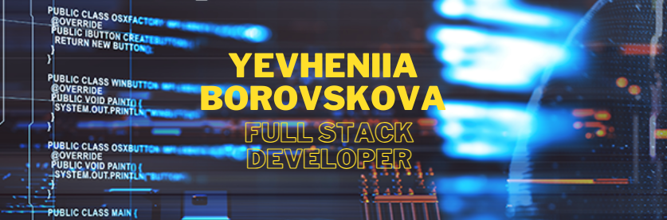

## Hi there 👋

Welcome to my corner of GitHub! ✨

I'm a Middle Software Engineer at AppsFlyer, a full-stack developer, a cloud engineer who is interested in learning new technologies and everything about the IT💻

---

#### The main technologies I use are

    
     
     
     
     
      

#### My next goals

 
     
     

### Get in touch with me

<!--
**Borovskova/Borovskova** is a ✨ _special_ ✨ repository because its `README.md` (this file) appears on your GitHub profile.

Here are some ideas to get you started:

- 🔭 I’m currently working on ...
- 🌱 I’m currently learning ...
- 👯 I’m looking to collaborate on ...
- 🤔 I’m looking for help with ...
- 💬 Ask me about ...
- 📫 How to reach me: ...
- 😄 Pronouns: ...
- ⚡ Fun fact: ...
-->
